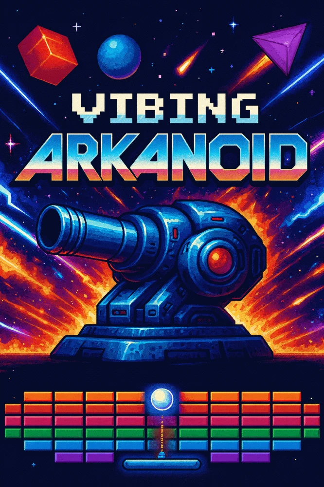

# 🕹️ Vibing Arkanoid

A loving tribute to the legendary **Arkanoid** (Taito, 1986) — rebuilt from scratch as a modern browser game with retro Amiga aesthetics, epic boss battles, and a high-performance canvas engine.

**[▶ Play Now](https://vibing-arkanoid.lovable.app)** · **v0.9.971**



---

## ✨ Features

- **20 levels** of increasing difficulty with hand-crafted brick layouts
- **4 boss battles** (levels 5, 10, 15) + a Mega Boss on level 20 with 3 phases, cross projectiles, music-reactive visuals, and danger ball mechanics
- **Boss Rush mode** — fight all bosses back-to-back
- **13 power-ups**: Fireball, Multi-Ball, Extend, Shield, Barrier, Slow Down, Turrets, Stunner, Reflect, Homing, Shrink, Extra Life, Second Chance
- **Q-U-M-R-A-N bonus letters** — collect all 6 for 5 extra lives
- **Two difficulty modes**: Normal (3 lives) and Godlike (1 life, faster speed)
- **Online leaderboards** with difficulty filters (All / Normal / God-Mode) and Boss Rush times
- **CRT overlay** and authentic retro pixel styling
- **Adaptive quality** — automatically adjusts visual effects for smooth performance
- **Mobile support** with touch controls and swipe gestures
- **Original chiptune soundtrack** with per-level music

## 🏗️ Architecture

The game runs a **decoupled engine** — all game objects (ball, paddle, bricks, bosses, enemies) update in a dedicated loop, separate from React's render cycle. The canvas draws directly from the engine world in its own `requestAnimationFrame` loop, bypassing React reconciliation entirely.

Key technical details:

- **Continuous Collision Detection (CCD)** with sub-stepping and TOI (Time of Impact) calculations
- **Spatial hashing** for efficient brick/entity collision lookups
- **Object pooling** for balls, power-ups, bullets, bombs, enemies, particles, and bonus letters
- **Cached gradients** and single `Date.now()` per frame to minimize allocations
- **Adaptive quality system** that scales visual effects (CRT overlay, glow, shadows) based on FPS
- **Production telemetry** for anonymous performance metrics

## 🛠️ Tech Stack

| Layer | Technology |
|-------|-----------|
| UI Framework | React 18 + TypeScript |
| Build Tool | Vite + PWA plugin |
| Styling | Tailwind CSS + custom retro design system |
| Components | shadcn/ui (menus, dialogs) |
| Rendering | HTML5 Canvas (manual 2D context) |
| Backend | Supabase (leaderboards, telemetry) |
| Hosting | Lovable Cloud |

## 🚀 Getting Started

```bash
# Clone the repo
git clone https://github.com/georgeflower/vibing-arkanoid.git
cd vibing-arkanoid

# Install dependencies
npm install

# Start dev server
npm run dev
```

The game runs at `http://localhost:5173`.

## 🎮 Controls

| Input | Action |
|-------|--------|
| Mouse / Arrow Keys | Move paddle |
| Touch drag | Move paddle (mobile) |
| Space | Launch ball / Shoot turrets |
| Escape | Pause menu |
| F | Toggle fullscreen |

## 📁 Project Structure

```
src/
├── engine/          # Decoupled game engine (state, render loop, canvas renderer)
├── components/      # React components (Game, HUD, menus, overlays)
├── constants/       # Game config, level layouts, boss configs
├── hooks/           # React hooks (power-ups, bullets, resize, quality)
├── utils/           # Collision detection, spatial hash, pools, sound, particles
├── assets/          # Sprites, backgrounds, power-up images
└── pages/           # Home page, game page, level editor
```

## 🤝 Contributing

This project is **100% open source** and proudly **vibe coded**. Contributions, bug reports, and feature requests are welcome!

1. Fork the repository
2. Create a feature branch (`git checkout -b feature/my-feature`)
3. Commit your changes
4. Push to the branch and open a Pull Request

## 📝 License

Open source. See the repository for license details.

---

*Built with [Lovable](https://lovable.dev)*
