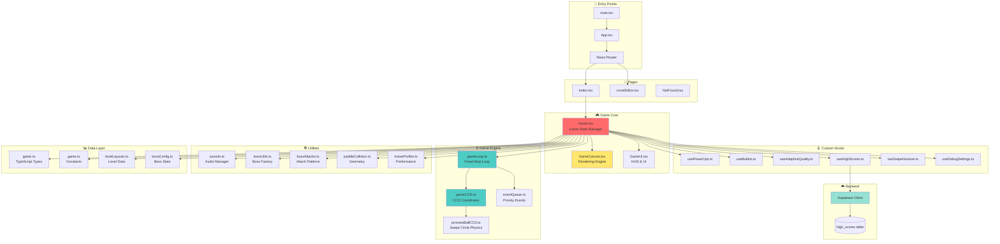
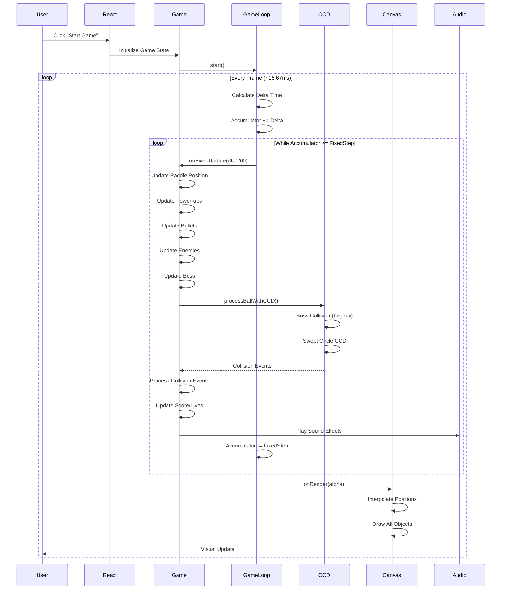
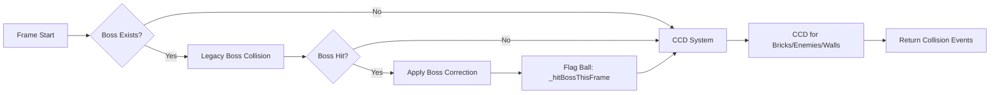
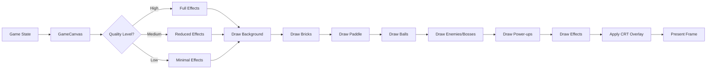

# System Architecture Overview

This document provides a high-level view of the Vibing Arkanoid architecture, component relationships, and data flow patterns.

---

## 🏗️ High-Level Architecture



---

## 🔄 Game Loop Flow



---

## 📁 Directory Structure

```
src/
├── main.tsx                    # Entry point, React mounting
├── App.tsx                     # App shell, routing setup
├── index.css                   # Global styles, design tokens
│
├── pages/
│   ├── Index.tsx               # Main menu or active game
│   ├── LevelEditor.tsx         # Visual level design tool
│   └── NotFound.tsx            # 404 page
│
├── components/
│   ├── Game.tsx                # 🔴 Core game orchestrator
│   ├── GameCanvas.tsx          # 🎨 Canvas 2D rendering
│   ├── GameUI.tsx              # 📊 HUD, pause, overlays
│   ├── MainMenu.tsx            # 🏠 Main menu screen
│   ├── EndScreen.tsx           # 🏁 Game over screen
│   ├── HighScoreDisplay.tsx    # 🏆 Leaderboard view
│   ├── HighScoreEntry.tsx      # ✏️ Initial entry form
│   ├── TopScoresDisplay.tsx    # 📈 Marquee scores
│   ├── CRTOverlay.tsx          # 📺 Retro scanlines
│   ├── MusicSettings.tsx       # 🎵 Audio controls
│   ├── Changelog.tsx           # 📰 Version history
│   └── Debug*.tsx              # 🐛 Debug overlays
│
├── hooks/
│   ├── usePowerUps.ts          # 🎁 Power-up management
│   ├── useBullets.ts           # 🔫 Turret bullets
│   ├── useHighScores.ts        # 🏆 Supabase scores
│   ├── useAdaptiveQuality.ts   # ⚡ Performance tuning
│   ├── useSwipeGesture.ts      # 👆 Mobile gestures
│   └── useDebugSettings.ts     # 🐛 Debug toggles
│
├── utils/
│   ├── gameLoop.ts             # ⚙️ Fixed-step loop
│   ├── gameCCD.ts              # 🎯 CCD coordinator
│   ├── processBallCCD.ts       # 🏐 Swept circle physics
│   ├── eventQueue.ts           # 📬 Event processing
│   ├── paddleCollision.ts      # 🏓 Paddle geometry
│   ├── sounds.ts               # 🔊 Audio manager
│   ├── bossUtils.ts            # 👾 Boss factory
│   ├── bossAttacks.ts          # ⚔️ Boss attacks
│   ├── frameProfiler.ts        # 📊 Performance profiler
│   ├── powerUpAssignment.ts    # 🎁 Power-up distribution
│   ├── powerUpImages.ts        # 🖼️ Power-up sprites
│   ├── bonusLetterImages.ts    # 🔤 Bonus letter sprites
│   └── collisionHistory.ts     # 📜 Debug collision log
│
├── constants/
│   ├── game.ts                 # 🎮 Game constants
│   ├── bossConfig.ts           # 👾 Boss configurations
│   ├── levelLayouts.ts         # 🗺️ Level patterns
│   └── version.ts              # 🔢 Version info
│
├── types/
│   └── game.ts                 # 📝 TypeScript definitions
│
└── integrations/
    └── supabase/
        ├── client.ts           # ☁️ Supabase client
        └── types.ts            # 📝 Database types
```

---

## 🎯 Core Component Responsibilities

### `Game.tsx` - Game Orchestrator
**Role**: Central hub for all game logic and state management

**Responsibilities**:
- Initialize and manage game state (lives, score, level, balls, paddle, bricks, enemies, bosses)
- Coordinate game loop via `FixedStepGameLoop`
- Process collision events from CCD system
- Handle power-up activation and effects
- Manage boss spawning, attacks, and defeat
- Control audio playback (music, sound effects)
- Handle pause/resume, game over, level progression
- Integrate custom hooks (usePowerUps, useBullets, useAdaptiveQuality, etc.)

**Key State**:
```typescript
lives: number
score: number
level: number
gameState: 'menu' | 'ready' | 'playing' | 'paused' | 'gameOver' | 'levelComplete'
balls: Ball[]
paddle: Paddle
bricks: Brick[]
enemies: Enemy[]
bosses: Boss[]
powerUps: PowerUp[]
```

### `GameCanvas.tsx` - Rendering Engine
**Role**: Pure rendering component using Canvas 2D API

**Responsibilities**:
- Draw all game objects at 60 FPS (or interpolated)
- Render bricks with special types (metal melting, cracked textures, explosive indicators)
- Draw ball with 3D gradient and fireball trail
- Render bosses with 3D geometry (cube/sphere/pyramid)
- Visual effects: screen shake, background flash, particles, explosions
- Adaptive quality rendering (reduce effects on low quality)

**Does NOT**:
- Manage game state
- Handle input
- Process collision
- Update game logic

### `GameUI.tsx` - HUD & Overlays
**Role**: Display UI elements over the game canvas

**Responsibilities**:
- HUD: Time, Score, Level, Lives, Speed
- Pause overlay with controls and keyboard shortcuts
- Ready message ("READY TO PLAY!")
- Level complete message
- Boss cooldown timer
- Turret ammo counter
- God mode indicator
- Mobile fullscreen controls

### `GameLoop.ts` - Fixed-Step Loop
**Role**: Deterministic physics simulation loop

**Responsibilities**:
- Run physics updates at fixed 60Hz (16.67ms steps)
- Use accumulator pattern to handle variable frame rates
- Provide interpolation alpha for smooth rendering
- Support pause/resume, time scaling
- Track frame ticks for determinism

**Architecture**: Separates simulation from rendering for frame-rate independence

---

## 🎮 Physics & Collision Architecture

### Boss-First Hybrid System



**Why Hybrid?**
1. **Boss Precision**: Legacy shape-aware collision (cube corners, sphere curves, pyramid angles) is more accurate than AABB approximation
2. **Avoid Double-Correction**: Bosses process first, ball is flagged, CCD skips flagged balls for boss collision
3. **Performance**: Boss collision is cheap (1-2 objects), CCD handles bulk of objects (hundreds of bricks)

### CCD (Continuous Collision Detection)

**Purpose**: Prevent ball tunneling through thin objects at high speeds

**Algorithm**:
1. **Sweep Ball**: Cast circle from current to target position
2. **Calculate TOI**: Time Of Impact with each object's expanded AABB
3. **Find Earliest**: Identify earliest collision in time (0.0 to 1.0)
4. **Move to TOI**: Position ball at exact collision point
5. **Reflect Velocity**: Apply reflection based on collision normal
6. **Iterate**: Repeat for remaining time slice (substeps)

**Substeps**: Dynamically calculated based on ball speed and game state
- Base: 2 substeps
- +1 if ball speed > 6 px/frame
- +1 if boss alive
- +1 if god mode
- Max: 6 substeps

---

## 📊 State Management Strategy

### React State (Declarative)
Used for data that triggers re-renders:
- Lives, score, level
- Game state (playing, paused, gameOver)
- Ball array, paddle object
- Bricks, enemies, bosses
- Power-ups

### Direct Manipulation (Imperative)
Used for performance-critical updates:
- Canvas rendering (no React re-render)
- Particle effects (ephemeral state)
- Audio playback (Web Audio API)
- Mouse position (input handling)

### Supabase Cloud (Persistent)
Used for cross-session data:
- High scores (all-time, weekly, daily)
- Player names and stats
- Level completion tracking

---

## 🎨 Rendering Pipeline



**Frame Budget**: Target 16.67ms per frame (60 FPS)
- Physics: ~5ms
- Rendering: ~8ms
- Events: ~2ms
- Buffer: ~1.67ms

---

## 🔌 Integration Points

### Supabase (Lovable Cloud)
- **Table**: `high_scores`
- **Operations**: SELECT (read), INSERT (write)
- **RLS**: Public read, authenticated insert (anonymous)
- **Hook**: `useHighScores.ts` abstracts all database logic

### Web Audio API
- **Manager**: `src/utils/sounds.ts`
- **Music**: 15 background tracks + boss music + high score music
- **SFX**: Preloaded buffers, synthesized tones
- **Volume Groups**: Music, power-ups, bricks, explosions

### Service Worker (PWA)
- **Registration**: `src/main.tsx`
- **Update Strategy**: Aggressive (check every 5 min)
- **Caching**: Workbox with skipWaiting + clientsClaim
- **Update Flow**: Detect in background → Toast notification → Apply at main menu

---

## 🧩 Dependency Graph

### Game.tsx Dependencies
```
Game.tsx
├── useDebugSettings
├── useAdaptiveQuality
├── usePowerUps
├── useBullets
├── useHighScores
├── useSwipeGesture
├── FixedStepGameLoop (gameLoop.ts)
├── processBallWithCCD (gameCCD.ts)
├── checkCircleVsRoundedPaddle (paddleCollision.ts)
├── createBoss, createResurrectedPyramid (bossUtils.ts)
├── performBossAttack (bossAttacks.ts)
├── frameProfiler, eventQueue
├── sounds.ts
└── All constants and types
```

### Circular Dependencies
**None**. Architecture enforces unidirectional data flow:
- Utils never import from components
- Hooks never import from components
- Components can import from hooks and utils
- Types are shared across all layers

---

## 🚀 Performance Considerations

### Critical Path (Every Frame)
1. **Input Processing**: Update paddle position from mouse/touch
2. **Physics Update**: Fixed 60Hz updates via game loop
3. **CCD Collision**: Swept circle for all balls
4. **Event Processing**: Handle collision events (max 50/frame, 5ms budget)
5. **Rendering**: Canvas 2D draw calls

### Optimization Strategies
- **Adaptive Quality**: Reduce visual complexity on FPS drops
- **Object Pooling**: Reuse particle objects instead of creating new
- **Culling**: Skip rendering off-screen objects
- **Debouncing**: Limit expensive operations (layout recalc, audio resampling)
- **Lazy Loading**: Load assets on-demand (boss textures, music tracks)

---

## 🐛 Debug Architecture

### Debug Dashboard
**Toggle**: Press `§` key  
**Features**: Enable/disable overlays, logging, quality indicators

### Available Overlays
- Game Loop Debug: FPS, accumulator, frame tick
- Substep Debug: CCD iterations, TOI counts
- CCD Performance: Timing breakdown (boss sweep, core CCD, post-processing)
- Collision History: Last 50 collisions with full state snapshots
- Frame Profiler: Subsystem timings, bottleneck detection
- Quality Indicator: Current FPS and quality level

### Logging Categories
- Collision events (ball hits)
- Power-up drops and collection
- Performance metrics (frame time, FPS)
- Paddle movement
- Boss attacks and damage
- Frame profiler stats

**Production**: Most logging disabled, quality indicator always visible

---

## 🎯 Next Steps

- **Understand game loop**: Read [Game Engine](./GAME_ENGINE.md)
- **Learn collision system**: Read [Physics & Collision](./PHYSICS.md)
- **Explore features**: Read [Game Mechanics](./GAME_MECHANICS.md)
- **Debug performance**: Read [Performance Optimization](./PERFORMANCE.md)
