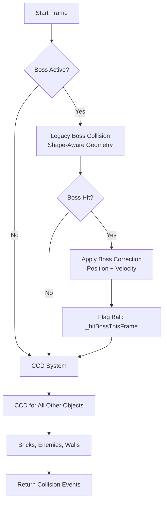

# Game Engine Documentation

The Vibing Arkanoid game engine consists of three core systems working together to provide deterministic, frame-rate independent physics simulation.

---

## 🎮 Core Systems Overview

1. **Fixed-Step Game Loop** (`src/utils/gameLoop.ts`)
2. **CCD Collision System** (`src/utils/gameCCD.ts`, `src/utils/processBallCCD.ts`)
3. **Event Queue** (`src/utils/eventQueue.ts`)

---

## ⚙️ Fixed-Step Game Loop

**File**: `src/utils/gameLoop.ts`

### Purpose
Provides deterministic physics simulation at fixed 60Hz regardless of display refresh rate or performance variations.

### Architecture: Accumulator Pattern

```typescript
// Pseudo-code
accumulator = 0
lastTime = now()

loop {
  currentTime = now()
  deltaTime = currentTime - lastTime
  lastTime = currentTime
  
  accumulator += deltaTime
  
  while (accumulator >= FIXED_STEP) {
    fixedUpdate(FIXED_STEP)  // Always 1/60th second
    accumulator -= FIXED_STEP
  }
  
  alpha = accumulator / FIXED_STEP
  render(alpha)  // Interpolate for smooth visuals
}
```

### Key Concepts

**Fixed Timestep**: Physics always advances by exactly `1/60` seconds (16.67ms)
- Ball at position X with velocity V
- After fixed update: position = X + V * (1/60)
- Same inputs = same outputs (determinism)

**Accumulator**: Stores leftover time between physics steps
- If frame takes 20ms, accumulator = 20ms
- Run one physics step (16.67ms), accumulator = 3.33ms leftover
- Carry over to next frame

**Interpolation Alpha**: Smooth rendering between physics steps
- Alpha = 0.0 → exactly at previous physics state
- Alpha = 1.0 → exactly at current physics state
- Alpha = 0.5 → halfway between (smooth transition)

### Configuration

```typescript
interface GameLoopConfig {
  fixedStep: number;       // Default: 1/60 (16.67ms)
  maxDeltaMs: number;      // Default: 250ms (spiral of death prevention)
  timeScale: number;       // Default: 1.0 (can slow-mo or speed up)
  mode: 'fixedStep' | 'legacy';  // Default: 'fixedStep'
}
```

### API

```typescript
const gameLoop = new FixedStepGameLoop({
  fixedStep: 1/60,
  maxDeltaMs: 250,
  timeScale: 1.0,
  mode: 'fixedStep'
});

// Set callbacks
gameLoop.setFixedUpdateCallback((dt: number) => {
  // Physics update: dt is always 1/60
  updatePhysics(dt);
});

gameLoop.setRenderCallback((alpha: number) => {
  // Render with interpolation: alpha is 0.0 to 1.0
  render(alpha);
});

// Control
gameLoop.start();
gameLoop.pause();
gameLoop.resume();
gameLoop.stop();

// Time manipulation
gameLoop.setTimeScale(0.5);  // Slow motion (50% speed)
gameLoop.setFixedHz(120);    // Run physics at 120Hz instead of 60Hz

// Debug info
const debug = gameLoop.getDebugInfo();
console.log(debug.fps, debug.accumulator, debug.frameTick);
```

### Frame Tick (Determinism)

**Purpose**: Monotonically increasing frame counter for deterministic logic

```typescript
const frameTick = gameLoop.getFrameTick();
// frameTick increments by 1 every fixed update
// Use for seeded random, animation cycles, periodic events
```

**Example Use**:
```typescript
// Spawn enemy every 600 frames (10 seconds at 60Hz)
if (frameTick % 600 === 0) {
  spawnEnemy();
}
```

### Spiral of Death Prevention

**Problem**: If physics takes longer than fixed step, accumulator grows forever
- Frame takes 50ms
- Run 2 physics steps (33ms total)
- Still 17ms in accumulator
- Next frame takes 50ms again
- Accumulator grows, game slows down, death spiral

**Solution**: Cap maximum delta time
```typescript
const cappedDelta = Math.min(deltaTime, maxDeltaMs);
accumulator += cappedDelta;
```

---

## 🎯 CCD Collision System

**Files**: 
- `src/utils/gameCCD.ts` (coordinator)
- `src/utils/processBallCCD.ts` (swept circle algorithm)

### Purpose
Prevent ball tunneling through thin objects (bricks, paddle) at high speeds using continuous collision detection.

### Problem: Discrete Collision Detection

```
Frame N:     Frame N+1:
  🧱              🧱
    🔵          🔵
                ❌ Ball tunnels through brick!
```

Ball moves so fast it "teleports" through brick between frames.

### Solution: Swept Circle (Continuous)

```
Frame N:     Sweep:      Frame N+1:
  🧱          🧱🔵          🧱
    🔵      ····             💥 Collision detected!
```

Cast ball's movement as a swept volume, find exact Time Of Impact (TOI).

### Architecture: Boss-First Hybrid



**Why Hybrid?**
1. Boss shapes are complex (cube edges, sphere curves, pyramid angles)
2. AABB approximation loses precision
3. Legacy collision handles exact geometry
4. Boss collision is cheap (1-2 objects)
5. CCD handles bulk objects (100+ bricks) efficiently

### CCD Algorithm (processBallCCD.ts)

#### Phase 1: Convert Game Objects to CCD Format

```typescript
// Ball
const ccdBall = {
  x: ball.x,
  y: ball.y,
  radius: ball.radius,
  dx: ball.dx * dtSeconds,  // Scale velocity by time
  dy: ball.dy * dtSeconds,
  speed: ball.speed,
  isFireball: ball.isFireball
};

// Bricks (AABB)
const ccdBricks = bricks.map(brick => ({
  id: brick.id,
  x: brick.x,
  y: brick.y,
  width: brick.width,
  height: brick.height,
  type: brick.type,
  isIndestructible: brick.type === 'metal',
  hitsRemaining: brick.hitsRemaining
}));

// Paddle (Rounded Rectangle)
const ccdPaddle = {
  x: paddle.x,
  y: paddle.y,
  width: paddle.width,
  height: paddle.height,
  cornerRadius: paddle.width * 0.15,
  velocityX: paddleVelocityX  // px/frame
};
```

#### Phase 2: Adaptive Substeps

```typescript
let substeps = 2;  // Base

if (ball.speed > 6) substeps++;      // Fast ball
if (boss) substeps++;                 // Boss active
if (godMode) substeps++;              // God mode precision
if (ball.isFireball) substeps++;      // Fireball needs more

substeps = Math.min(substeps, 6);    // Cap at 6
```

#### Phase 3: Swept Circle Collision

For each substep:

**3.1: Find Earliest Collision (TOI)**

```typescript
let earliestTOI = 1.0;  // 1.0 = full movement
let earliestObject = null;

for (const brick of bricks) {
  const toi = sweepCircleVsAABB(ball, brick);
  if (toi < earliestTOI) {
    earliestTOI = toi;
    earliestObject = brick;
  }
}

// Also check: paddle, enemies, walls
```

**Swept Circle vs AABB (Minkowski Sum)**:
```typescript
// Expand AABB by ball radius
const expandedAABB = {
  left: brick.x - ball.radius,
  right: brick.x + brick.width + ball.radius,
  top: brick.y - ball.radius,
  bottom: brick.y + brick.height + ball.radius
};

// Ray-cast ball center against expanded AABB
const toi = rayVsAABB(ball.x, ball.y, ball.dx, ball.dy, expandedAABB);
```

**3.2: Move Ball to TOI**

```typescript
ball.x += ball.dx * earliestTOI;
ball.y += ball.dy * earliestTOI;
```

**3.3: Reflect Velocity**

```typescript
// Determine collision normal (perpendicular to surface)
const normal = getCollisionNormal(ball, earliestObject);

// Reflect velocity: V' = V - 2 * (V · N) * N
const dotProduct = ball.dx * normal.x + ball.dy * normal.y;
ball.dx -= 2 * dotProduct * normal.x;
ball.dy -= 2 * dotProduct * normal.y;

// Preserve speed
const currentSpeed = Math.sqrt(ball.dx**2 + ball.dy**2);
const scale = ball.speed / currentSpeed;
ball.dx *= scale;
ball.dy *= scale;
```

**3.4: Record Collision Event**

```typescript
collisionEvents.push({
  objectType: 'brick',
  objectId: brick.id,
  ballId: ball.id,
  collisionPoint: { x: ball.x, y: ball.y },
  collisionNormal: normal,
  timestamp: performance.now()
});
```

**3.5: Iterate Remaining Time**

```typescript
const remainingTime = 1.0 - earliestTOI;
ball.dx *= remainingTime;
ball.dy *= remainingTime;

// Repeat for next substep
```

#### Phase 4: Special Cases

**Fireball Pass-Through**:
```typescript
if (ball.isFireball && brick.type !== 'metal') {
  // Reconstruct pre-bounce velocity
  const preBounceVelocity = {
    dx: ball.dx - 2 * dotProduct * normal.x,
    dy: ball.dy - 2 * dotProduct * normal.y
  };
  
  // Restore pre-bounce velocity (undo reflection)
  ball.dx = preBounceVelocity.dx;
  ball.dy = preBounceVelocity.dy;
  
  // Ball continues through brick
}
```

**Paddle Position-Based Launcher**:
```typescript
// Impact position on paddle: -1.0 (left) to +1.0 (right)
const impactPos = (ball.x - paddle.center) / (paddle.width / 2);

// Map to launch angle: -80° to +80°
const angle = impactPos * 80 * (Math.PI / 180);

// Set new velocity (preserve speed)
ball.dx = Math.sin(angle) * ball.speed;
ball.dy = -Math.cos(angle) * ball.speed;  // Negative = upward
```

### CCD Performance Metrics

**Timings** (returned in CCDResult):
```typescript
{
  bossSweepMs: 0.5,      // Boss collision check
  ccdCoreMs: 2.3,        // Main CCD algorithm
  postProcessMs: 0.8,    // Event processing
  totalMs: 3.6           // Total time
}
```

**Bottleneck Detection**:
- > 5ms total = performance issue
- > 3ms CCD core = too many objects or substeps
- > 1ms post-process = too many collision events

---

## 📬 Event Queue System

**File**: `src/utils/eventQueue.ts`

### Purpose
Prevent frame spikes from too many events firing simultaneously (e.g., 50 bricks destroyed by explosive chain reaction).

### Architecture

**Priority Levels**:
- `high`: Critical gameplay events (ball hit paddle, life lost)
- `medium`: Standard events (brick destroyed, power-up dropped)
- `low`: Visual/audio feedback (particle spawn, sound effect)

**Budget Controls**:
- Max 50 events per frame
- Max 5ms processing time per frame

### API

```typescript
interface GameEvent {
  id: string;
  type: string;
  priority: 'high' | 'medium' | 'low';
  timestamp: number;
  data: any;
  handler: (data: any) => void;
}

// Enqueue event
eventQueue.enqueue({
  id: 'brick-hit-123',
  type: 'BRICK_DESTROYED',
  priority: 'medium',
  data: { brickId: 123, score: 100 },
  handler: (data) => {
    score += data.score;
    playSound('brick-hit');
  }
});

// Process events (call every frame)
const result = eventQueue.process();
console.log(result.processed, result.remaining, result.timeSpent);
```

### Event Processing Order

1. **Sort by priority**: high → medium → low
2. **Within priority**: Older events first (FIFO)
3. **Process up to budget**: 50 events OR 5ms, whichever comes first
4. **Carry over**: Remaining events processed next frame

### Example: Explosive Chain Reaction

```typescript
// Frame 1: Explosive brick hit
eventQueue.enqueue({ type: 'EXPLOSIVE_HIT', priority: 'high', ... });

// Process: Destroys 20 bricks
for (const brick of destroyedBricks) {
  eventQueue.enqueue({ type: 'BRICK_DESTROYED', priority: 'medium', ... });
  eventQueue.enqueue({ type: 'PARTICLE_SPAWN', priority: 'low', ... });
}

// Frame 1 processes: 1 high + 20 medium + 20 low = 41 events
// Frame 2 processes: Remaining 9 low priority events
```

**Result**: Explosion spread over 2 frames instead of causing 50-event spike.

---

## 🔄 Integration: Game.tsx

### Fixed Update Callback

```typescript
gameLoop.setFixedUpdateCallback((dt: number) => {
  // dt is always 1/60
  
  // 1. Update paddle
  updatePaddle(dt);
  
  // 2. Update power-ups (fall down)
  updatePowerUps(dt);
  
  // 3. Update bullets (turrets)
  updateBullets(dt);
  
  // 4. Update enemies (movement)
  updateEnemies(dt);
  
  // 5. Update boss (movement, attacks)
  updateBoss(dt);
  
  // 6. Process balls with CCD
  for (const ball of balls) {
    const result = processBallWithCCD(
      ball,
      dt,
      gameLoop.getFrameTick(),
      { bricks, paddle, enemies, boss, canvasWidth, canvasHeight }
    );
    
    // 7. Queue collision events
    for (const event of result.collisionEvents) {
      eventQueue.enqueue(event);
    }
  }
  
  // 8. Process event queue
  eventQueue.process();
  
  // 9. Check win/lose conditions
  checkGameOver();
});
```

### Render Callback

```typescript
gameLoop.setRenderCallback((alpha: number) => {
  // Interpolate positions for smooth rendering
  
  for (const ball of balls) {
    const renderX = ball.prevX + (ball.x - ball.prevX) * alpha;
    const renderY = ball.prevY + (ball.y - ball.prevY) * alpha;
    drawBall(renderX, renderY);
  }
  
  // Similar for paddle, enemies, etc.
});
```

---

## 🧪 Testing & Debugging

### Frame Profiler

```typescript
import { frameProfiler } from '@/utils/frameProfiler';

frameProfiler.enable();

// In fixed update
frameProfiler.startFrame();

frameProfiler.startTiming('physics');
// ... physics code ...
frameProfiler.endTiming('physics');

frameProfiler.startTiming('rendering');
// ... rendering code ...
frameProfiler.endTiming('rendering');

frameProfiler.endFrame();

// Get stats
const stats = frameProfiler.getStats();
console.log(stats.fps, stats.timings.physics, stats.bottlenecks);
```

### Debug Overlays

- **Game Loop Debug** (ESC → Enable): FPS, accumulator, frame tick
- **Substep Debug**: CCD iterations, TOI counts, collision events
- **CCD Performance**: Timing breakdown (boss sweep, CCD core, post-process)

### Common Issues

**Issue**: Ball tunnels through bricks at high speed  
**Cause**: Not enough substeps  
**Fix**: Increase substeps for high-speed balls

**Issue**: Physics slow-down over time  
**Cause**: Event queue backing up  
**Fix**: Check event processing time, reduce event complexity

**Issue**: Jittery rendering  
**Cause**: Not using interpolation alpha  
**Fix**: Interpolate positions in render callback

---

## 🎯 Performance Targets

| System | Target | Measured |
|--------|--------|----------|
| **Fixed Update** | < 8ms | ~5ms |
| **CCD per Ball** | < 3ms | ~2ms |
| **Event Queue** | < 2ms | ~1ms |
| **Total Physics** | < 10ms | ~8ms |

Leaves 6-7ms for rendering, input, and other systems to hit 60 FPS (16.67ms budget).

---

## 🚀 Future Optimizations

1. **Spatial Partitioning**: Grid or quadtree for broad-phase collision culling
2. **Object Pooling**: Reuse event objects instead of creating new
3. **SIMD Physics**: Vectorize collision checks for multiple balls
4. **Web Workers**: Offload CCD to background thread
5. **Predictive Collision**: Cache potential collision objects for next frame

---

## 🎯 Next Steps

- **Understand collision details**: Read [Physics & Collision](./PHYSICS.md)
- **Learn game features**: Read [Game Mechanics](./GAME_MECHANICS.md)
- **Performance tuning**: Read [Performance Optimization](./PERFORMANCE.md)
