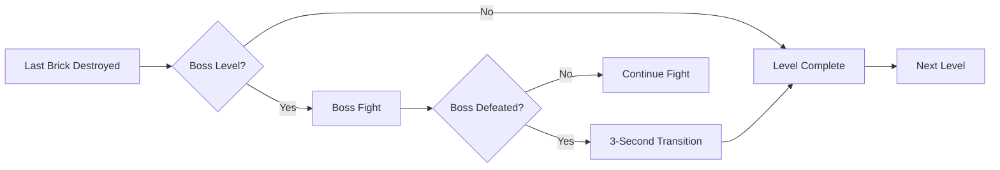

# Game Mechanics Documentation

Complete guide to all gameplay features, power-ups, scoring, and progression systems.

---

## 🧱 Brick System

### Brick Types

| Type | Hits | Destructible | Special Behavior |
|------|------|--------------|------------------|
| **Normal** | 1-5* | ✅ Yes | Progressive hits based on level and row |
| **Metal** | ∞ | ❌ No | Reflects ball, destroyed by explosions |
| **Cracked** | 3 | ✅ Yes | Visual damage progression, pitch-changing sounds |
| **Explosive** | 1 | ✅ Yes | Chain reaction, destroys neighbors in 80px radius |

*Normal bricks require more hits on higher levels and lower rows

### Progressive Difficulty (Normal Bricks)

**File**: `src/constants/levelLayouts.ts` → `getBrickHits(level, row)`

```typescript
function getBrickHits(level: number, row: number): number {
  const baseHits = 1;
  
  // Every 3 levels: +1 hit
  const levelBonus = Math.floor((level - 1) / 3);
  
  // Every 2 rows from bottom: +1 hit
  const rowBonus = Math.floor((BRICK_ROWS - row) / 2);
  
  const totalHits = baseHits + levelBonus + rowBonus;
  return Math.max(1, Math.min(totalHits, 5)); // Cap at 5 hits
}
```

**Examples**:
- Level 1, Row 0 (top): 1 hit
- Level 1, Row 7 (bottom): 3 hits
- Level 10, Row 0: 4 hits
- Level 10, Row 7: 6 hits (capped at 5)

### Brick Layout Encoding

**File**: `src/constants/levelLayouts.ts`

```typescript
const levelLayouts: Record<number, (boolean | number)[][]> = {
  1: [
    [true, true, true, true, true],  // Normal bricks
    [2, 2, 2],                        // Metal bricks
    [3, true, 3],                     // Explosive, normal, explosive
    [4, 4, 4]                         // Cracked bricks
  ]
};
```

**Brick Codes**:
- `true` = Normal brick
- `2` = Metal (indestructible)
- `3` = Explosive
- `4` = Cracked (3 hits)
- `false` = Empty space

### Brick Dimensions

**File**: `src/constants/game.ts`

```typescript
BRICK_WIDTH = 56;    // pixels
BRICK_HEIGHT = 21;   // pixels
BRICK_PADDING = 4;   // gap between bricks
BRICK_COLS = 10;     // bricks per row
BRICK_ROWS = 8;      // rows of bricks
```

### Color Palettes

**4 palettes cycling every 5 levels**:

```typescript
const palettes = [
  ['#FF6B6B', '#4ECDC4', '#45B7D1', '#96CEB4'], // Palette 1: Red, Cyan, Blue, Green
  ['#FFD93D', '#6BCF7F', '#4D96FF', '#FF6B9D'], // Palette 2: Yellow, Green, Blue, Pink
  ['#A8E6CF', '#FFD3B6', '#FFAAA5', '#FF8B94'], // Palette 3: Mint, Peach, Salmon, Rose
  ['#C7CEEA', '#B5EAD7', '#E2F0CB', '#FFDAC1']  // Palette 4: Lavender, Aqua, Lime, Cream
];

const paletteIndex = Math.floor((level - 1) / 5) % palettes.length;
```

---

## 🎁 Power-Up System

### Power-Up Types

| Icon | Type | Effect | Duration |
|------|------|--------|----------|
| 🔴 | Multiball | Splits ball into 3 | Until balls are lost |
| 🔫 | Turrets | Cannon shots | 30 shots (15 in god mode) |
| 🔥 | Fireball | Pass through bricks | 10 seconds |
| ❤️ | Extra Life | +1 life | Permanent |
| 🐌 | Slowdown | -33% ball speed | 15 seconds |
| ↔️ | Paddle Extend | +50% paddle width | 15 seconds |
| ↕️ | Paddle Shrink | -33% paddle width | 15 seconds |
| 🛡️ | Shield | Block 1 hit | Until hit or timeout |

### Power-Up Drop System

**File**: `src/utils/powerUpAssignment.ts`

**Strategy**: Pre-assignment at level initialization

```typescript
// 5% of destructible bricks get power-ups
const eligibleBricks = bricks.filter(b => 
  b.type !== 'metal' && b.isVisible
);

const numPowerUps = Math.floor(eligibleBricks.length * 0.05);

// Randomly assign power-ups
for (let i = 0; i < numPowerUps; i++) {
  const brick = randomChoice(eligibleBricks);
  brick.assignedPowerUp = randomPowerUpType();
}
```

**Special Cases**:
- **Boss Minions**: 50% drop chance (overrides 5% rule)
- **Extra Life**: Max 1 per 5-level group (1-5, 6-10, etc.)
- **Turrets**: Increased chance (50%) if level time > 90 seconds

### Power-Up Effects Implementation

**File**: `src/hooks/usePowerUps.ts` → `checkPowerUpCollision()`

#### Multiball
```typescript
if (powerUp.type === 'multiball') {
  const newBalls: Ball[] = [];
  
  for (const ball of balls) {
    // Create 2 additional balls at ±30° angles
    const angle1 = Math.atan2(ball.dy, ball.dx) + Math.PI / 6;
    const angle2 = Math.atan2(ball.dy, ball.dx) - Math.PI / 6;
    
    newBalls.push({
      ...ball,
      id: nextBallId++,
      dx: Math.cos(angle1) * ball.speed,
      dy: Math.sin(angle1) * ball.speed
    });
    
    newBalls.push({
      ...ball,
      id: nextBallId++,
      dx: Math.cos(angle2) * ball.speed,
      dy: Math.sin(angle2) * ball.speed
    });
  }
  
  setBalls([...balls, ...newBalls]);
  playSound('multiball');
}
```

#### Turrets
```typescript
if (powerUp.type === 'turrets') {
  setPaddle(prev => ({
    ...prev,
    hasTurrets: true,
    turretAmmo: godMode ? 15 : 30
  }));
  
  playSound('turrets');
  toast('TURRETS ACTIVATED!');
}
```

#### Fireball
```typescript
if (powerUp.type === 'fireball') {
  setBalls(prevBalls => prevBalls.map(ball => ({
    ...ball,
    isFireball: true
  })));
  
  // Auto-expire after 10 seconds
  clearTimeout(fireballTimeoutRef.current);
  fireballTimeoutRef.current = setTimeout(() => {
    setBalls(prevBalls => prevBalls.map(ball => ({
      ...ball,
      isFireball: false
    })));
  }, 10000);
  
  playSound('fireball');
}
```

#### Extra Life
```typescript
if (powerUp.type === 'life') {
  // Check if already used in this level group
  const currentGroup = Math.floor((level - 1) / 5);
  
  if (!extraLifeUsedLevels.includes(currentGroup)) {
    setLives(prev => prev + 1);
    setExtraLifeUsedLevels(prev => [...prev, currentGroup]);
    playSound('extra-life');
    toast('EXTRA LIFE! 👤');
  } else {
    // Already got extra life in this group, skip
    return prevPowerUps; // Don't remove from screen
  }
}
```

#### Speed Modification
```typescript
if (powerUp.type === 'slowdown') {
  setSpeedMultiplier(0.67); // 33% slower
  
  setTimeout(() => {
    setSpeedMultiplier(1.0);
  }, 15000);
  
  playSound('slower');
}
```

#### Paddle Size
```typescript
if (powerUp.type === 'paddleExtend') {
  setPaddle(prev => ({
    ...prev,
    width: prev.width * 1.5
  }));
  
  setTimeout(() => {
    setPaddle(prev => ({
      ...prev,
      width: prev.width / 1.5
    }));
  }, 15000);
  
  playSound('wider');
}
```

#### Shield
```typescript
if (powerUp.type === 'shield') {
  setPaddle(prev => ({
    ...prev,
    hasShield: true
  }));
  
  playSound('shield');
  toast('SHIELD ACTIVE! 🛡️');
  
  // Shield lasts until hit or 30 seconds
  setTimeout(() => {
    setPaddle(prev => ({
      ...prev,
      hasShield: false
    }));
  }, 30000);
}
```

---

## 🔫 Turret System

**File**: `src/hooks/useBullets.ts`

### Firing Mechanics

```typescript
// Space bar held down
if (paddle.hasTurrets && paddle.turretAmmo > 0) {
  // Fire rate: 10 bullets per second
  const FIRE_INTERVAL = 100; // ms
  
  if (performance.now() - lastFireTime >= FIRE_INTERVAL) {
    createBullet({
      x: paddle.x + paddle.width / 2,
      y: paddle.y - 10,
      speed: 8, // px/frame
      direction: 'up'
    });
    
    paddle.turretAmmo--;
    lastFireTime = performance.now();
    playSound('turret-fire');
  }
}

// Auto-deactivate when ammo depleted
if (paddle.turretAmmo <= 0) {
  paddle.hasTurrets = false;
  toast('TURRETS DEPLETED');
}
```

### Bullet Collision

```typescript
for (const bullet of bullets) {
  bullet.y -= bullet.speed;
  
  // Check vs bricks
  for (const brick of bricks) {
    if (isColliding(bullet, brick)) {
      // Metal bricks stop bullets
      if (brick.type === 'metal') {
        playSound('metal-clang');
        removeBullet(bullet);
        break;
      }
      
      // Other bricks take damage
      brick.hitsRemaining--;
      if (brick.hitsRemaining <= 0) {
        brick.isVisible = false;
        score += calculateScore(brick);
        brickDestroyedByTurret++;
      }
      
      removeBullet(bullet);
      break;
    }
  }
  
  // Check vs enemies
  for (const enemy of enemies) {
    if (isColliding(bullet, enemy)) {
      enemy.health--;
      if (enemy.health <= 0) {
        enemy.isAlive = false;
        enemiesKilled++;
      }
      removeBullet(bullet);
      break;
    }
  }
  
  // Remove off-screen bullets
  if (bullet.y < 0) {
    removeBullet(bullet);
  }
}
```

---

## 🔤 Bonus Letters System

### Letter Sequence: Q-U-M-R-A-N

**Purpose**: Spell "QUMRAN" for massive bonus

**Reward**:
- 5 extra lives
- 500,000 points

### Drop Mechanics

**File**: `src/components/Game.tsx`

```typescript
// Eligible levels: 2, 4, 6, 8, 10, 12 (even levels)
const eligibleLevels = [2, 4, 6, 8, 10, 12];
const letters = ['Q', 'U', 'M', 'R', 'A', 'N'];

// Assign letters to random eligible levels (at game start)
const bonusLetterLevels = shuffle(eligibleLevels).slice(0, 6);
const bonusLetterMap = {
  [bonusLetterLevels[0]]: 'Q',
  [bonusLetterLevels[1]]: 'U',
  [bonusLetterLevels[2]]: 'M',
  [bonusLetterLevels[3]]: 'R',
  [bonusLetterLevels[4]]: 'A',
  [bonusLetterLevels[5]]: 'N'
};

// Drop when first brick is destroyed on eligible level
if (bonusLetterMap[level] && !bonusLetterDropped[level]) {
  const letter = bonusLetterMap[level];
  createBonusLetter(letter, brick.x, brick.y);
  bonusLetterDropped[level] = true;
}
```

### Collection & Tracking

```typescript
// Collect letter
if (isColliding(paddle, bonusLetter)) {
  collectedLetters.push(bonusLetter.letter);
  playSound('bonus-letter');
  toast(`COLLECTED: ${bonusLetter.letter}`);
  
  // Check for completion
  if (collectedLetters.sort().join('') === 'ANMQRU') {
    // Bonus!
    lives += 5;
    score += 500000;
    playSound('bonus-complete');
    toast('QUMRAN COMPLETE! +5 LIVES & +500K!', { duration: 5000 });
    
    // Visual celebration
    triggerConfetti();
  }
}
```

### Letter Images

**File**: `src/utils/bonusLetterImages.ts`

```typescript
import bonusQ from '@/assets/bonus-q.png';
import bonusU from '@/assets/bonus-u.png';
import bonusM from '@/assets/bonus-m.png';
import bonusR from '@/assets/bonus-r.png';
import bonusA from '@/assets/bonus-a.png';
import bonusN from '@/assets/bonus-n.png';

export const bonusLetterImages: Record<string, HTMLImageElement> = {
  Q: loadImage(bonusQ),
  U: loadImage(bonusU),
  M: loadImage(bonusM),
  R: loadImage(bonusR),
  A: loadImage(bonusA),
  N: loadImage(bonusN)
};
```

---

## 📊 Scoring System

### Base Scores

```typescript
const SCORES = {
  brick: 100,
  cracked: 150,
  explosive: 200,
  enemy: 500,
  boss: 5000
};
```

### Score Multipliers

```typescript
// Difficulty multiplier
const difficultyMultiplier = {
  easy: 0.8,
  normal: 1.0,
  hard: 1.5
}[difficulty];

// Level multiplier
const levelMultiplier = 1 + (level - 1) * 0.1;

// Final score
const finalScore = baseScore * difficultyMultiplier * levelMultiplier;
```

### Special Bonuses

```typescript
// Level complete bonus
const levelCompleteBonus = level * 1000;

// Time bonus (complete level under 60 seconds)
if (levelTime < 60) {
  const timeBonus = (60 - levelTime) * 100;
}

// Boss defeat bonus
if (bossDefeated) {
  const bossBonus = 5000 + (level * 500);
}
```

---

## ⚡ Speed System

### Base Speed

```typescript
const BASE_BALL_SPEED = 4.5; // px/frame
```

### Progressive Speed Increase

```typescript
// Level progression: +0.1 px/frame per level
const levelSpeed = BASE_BALL_SPEED + (level - 1) * 0.1;

// Examples:
// Level 1: 4.5
// Level 10: 5.4
// Level 20: 6.3
// Level 50: 9.4
```

### Speed Multipliers

```typescript
// God mode: 25% faster
if (godMode) {
  levelSpeed *= 1.25;
}

// Slowdown power-up: 33% slower
if (hasSlowdown) {
  levelSpeed *= 0.67;
}

// Final ball speed
ball.speed = levelSpeed * speedMultiplier;
```

---

## 🎮 Game Modes

### Normal Mode

```typescript
const normalMode = {
  lives: 3,
  speed: 'normal',
  turretAmmo: 30,
  difficulty: 'normal'
};
```

### God Mode (Godlike)

```typescript
const godMode = {
  lives: 3,           // Same lives
  speed: 1.25,        // 25% faster
  turretAmmo: 15,     // Half ammo (challenge!)
  difficulty: 'hard'  // Harder scoring
};
```

**Access**: Click title 5 times on main menu

---

## 🏁 Level Progression

### Level Complete Conditions

```typescript
// Win: All destructible bricks destroyed
const destructibleBricks = bricks.filter(b => 
  b.isVisible && b.type !== 'metal'
);

if (destructibleBricks.length === 0) {
  levelComplete();
}
```

### Level Transition Flow



### Boss Levels

```typescript
const BOSS_LEVELS = [5, 10, 15];

if (BOSS_LEVELS.includes(level)) {
  spawnBoss(level);
}
```

---

## 👾 Enemy System

### Enemy Spawning

```typescript
// Spawn every 20 seconds
const ENEMY_SPAWN_INTERVAL = 20000; // ms

if (performance.now() - lastEnemySpawn >= ENEMY_SPAWN_INTERVAL) {
  const enemy = {
    id: nextEnemyId++,
    x: random(50, canvasWidth - 50),
    y: 50,
    type: randomChoice(['cube', 'sphere', 'pyramid']),
    health: 3,
    speed: 2 // px/frame
  };
  
  enemies.push(enemy);
  lastEnemySpawn = performance.now();
}
```

### Enemy Movement

```typescript
// Enemies move horizontally, bounce off walls
enemy.x += enemy.direction * enemy.speed;

if (enemy.x <= 0 || enemy.x >= canvasWidth) {
  enemy.direction *= -1; // Reverse direction
}
```

### Enemy Collision Reward

```typescript
if (enemyKilled) {
  score += 500;
  enemiesKilled++;
  
  // Boss minions: 50% power-up chance
  if (enemy.isBossMinion) {
    if (Math.random() < 0.5) {
      createPowerUp(enemy.x, enemy.y);
      toast('BOSS MINION BONUS!');
    }
  }
}
```

---

## 🎯 Win/Lose Conditions

### Game Over

```typescript
// Lose all lives
if (lives <= 0) {
  gameState = 'gameOver';
  stopMusic();
  playSound('game-over');
  
  // Check for high score
  if (isHighScore(score)) {
    showHighScoreEntry();
  } else {
    showStatistics();
  }
}
```

### Beat Level 50

```typescript
// Win: Complete level 50
if (level === 50 && allBricksDestroyed) {
  gameState = 'victory';
  playSound('victory');
  
  // Save achievement
  saveHighScore({ beatLevel50: true });
  
  showVictoryScreen();
}
```

---

## 📈 Statistics Tracking

**File**: `src/components/Game.tsx`

```typescript
const gameStats = {
  totalPlayTime: 0,           // ms
  powerUpsCollected: 0,       // count
  bricksDestroyedByTurret: 0, // count
  enemiesKilled: 0,           // count
  bossesKilled: 0,            // count
  finalScore: 0,              // points
  finalLevel: 0,              // level reached
  difficulty: 'normal'        // difficulty setting
};
```

**Display**: Shown on end screen after game over

---

## 🎯 Next Steps

- **Understand bosses**: Read [Boss System](./BOSS_SYSTEM.md)
- **Learn level design**: Read [Level System](./LEVEL_SYSTEM.md)
- **Explore rendering**: Read [Rendering & Graphics](./RENDERING.md)
